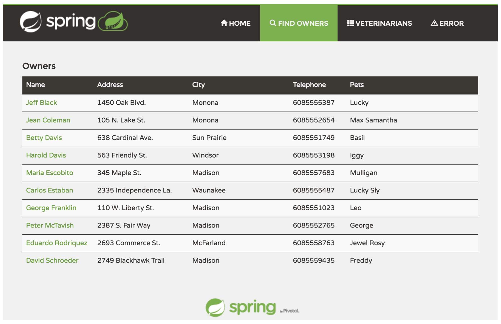
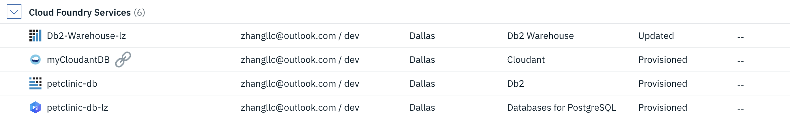
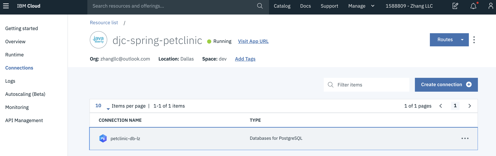

# Using the Cloud Foundry Command-Line Interface


Overview
========

In this lab, you will use the Cloud Foundry command-line interface (CLI) to work with an IBM Cloud Foundry application. The cf CLI is a tool that you will use in a terminal or command window on your workstation.


Prerequisites
-------------

You need the following accounts and software:

-   An [IBM Cloud account](https://console.bluemix.net/registration)

-   An Internet Explorer, Firefox, or Chrome web browser

The Cloud Foundry (cf) CLI will be installed as part of the lab exercise.


Section 1. Installing the IBM Cloud CLI
=======================================

The IBM Cloud CLI includes a supported copy of the Cloud Foundry CLI which you will be using for this lab. If you already have the IBM CLI and Cloud Foundry CLI installed, skip to the next lab section


1.  In a web browser, open the [IBM Cloud CLI page](https://cloud.ibm.com/docs/cli/reference/ibmcloud?topic=cloud-cli-install-ibmcloud-cli).

2.  Click on the download link specific to your workstation platform to download the package. **Installers** download links were verified for Windows and MacOS platforms.

3.  Follow the steps appropriate to your workstation operating system. 
    > For MacOS and Windows, after downloading the package, run the installer.
    >
    > For Linux, use sudo (or root if necessary) to run the installer.
        
       ```
       curl -fsSL https://clis.cloud.ibm.com/install/linux | sh
       ```
After the IBM Cloud CLI is installed, proceed to the next lab section.


Section 2. Downloading Sample Application
=========================================

In this lab, you will work with the `Spring PetClinic Sample Application`. To download the sample application,

1.  Open a command or terminal window. Note that the cf CLI tool can have issues with cygwin bash shell. It's recommended to use Windows cmd, powershell, or git bash.

2. Download the sample application.

   ```
   git clone https://github.com/IBMAppModernization/spring-petclinic-cf-postgresql.git
   ```

3. Navigate to the directory of the sample application.

   ```
   cd spring-petclinic-cf-postgresql
   ```


Section 3. Compiling and Running the Sample Application Locally
===============================================================

To run the sample application locally,

1.  In the same command or terminal window, compile the sample application. This may take a minute or two.

    ```bash
    mvn package
    ```

2. Run the application locally.

    ```bash
    java -jar target/spring-petclinic-cf-2.1.0.jar
    ```
    
3. You can then access the applcation at http://localhost:8080/


Section 4. Deploying to the IBM Cloud Foundry (cf) via CLI witout Database Service
==================================================================================

In this section, you will deploy the `Spring PetClinic Sample Application` to IBM Cloud Foundry using the command line.

1.  In the same command or terminal window.

2.  Log in to Cloud Foundry by issuing the following commands.
    
    ```
    ibmcloud login
    ```

3.  Enter the email and password that you used to log in to the IBM Cloud web UI. When you log in, you will be prompted to choose the cloud account to use if there is more than one associated with your IBM id.

4. After logging in set your preferred Cloud Foundry organization and space using this command:

   ```
   ibmcloud target --cf
   ```

5. For the rest of this lab, you will mostly be using the CF cli (cf). If you are using a **bash shell** you can optionally create an alias to this command with
   ```
   alias cf='ibmcloud cf'
   ```
   With the alias, you don't need to enter **ibmcloud** in the following steps.

6. Open file manifest.yml in a file editor and find the following section at the begining.

   ```
   applications:
   - name: spring-petclinic
   ```

7. Change the **application name** in the manifest.yml file.

   ```
   applications:
   - name: spring-petclinic-###
   ```

   **###** is a number assigned to you during the workshop.

8. Deploy the application to IBM Cloud Foundry.

    ```bash
    ibmcloud cf push
    ```
    This will create an application, define a route for the application and upload the artifacts of the application.

9. To locate the application url, execute the command below

    ```
    ibmcloud cf apps
    ```

    Its output is similar to 

    ```
    name                       requested state   instances   memory   disk   urls
    spring-petclinic-###       started           1/1         768M     1G     spring-petclinic-###-semijuridic-sciatically.mybluemix.net
    ```

    The URTL to access your application is

    ```
    https://[urls OUTPUT]
    ```

    For example, https://spring-petclinic-035-semijuridic-sciatically.mybluemix.net

10. Before testing your application, enable logging in the same terminal session with the `cf logs` command using the name of your newly deployed application.

   ```

   cf logs spring-petlclinic-###
   ```

11. To test your application, open a browser and access the url above.

12. In the application, navigate to `FIND OWNERS` tab on the top.

13. Click `Add Owner` button.

14. Enter your information and click `Add Owner`.

15. Click the `FIND OWNERS` tab on the top.

16. Click `Find Owner` to see a list of owners including the new entry that you entered in the preview step.



17. Navigate to the terminal window, notice that now it is streaming real-time the events from the application.

18. In the command window, `Stop` the application via the CLI command below.

    ```
    ibmcloud cf stop spring-petclinic-###
    ```

19. `Start` the application.

    ```
    ibmcloud cf start spring-petclinic-###
    ```

20. Go back to the application UI, `FIND OWNERS` tab -> `Find Owner` button.

21. The new owner entry does not exist. 


Section 5. Deploying to the IBM Cloud Foundry (cf) via CLI with Database Service
================================================================================

In this section, you will create a PostgreSQL service instance and then redeploy the `Spring PetClinic Sample Application` to IBM Cloud Foundry using the command line.

1.  In the same command or terminal window.

2.  Before you redeploy the application, you will create a PostgreSQL database service instance. Optionally,you can view the available services by running the following command:

    ibmcloud cf marketplace

    This command will take a little while to run because it collects all catalog entries.

3. Create your PostgreSQL database service.

   The PostgreSQL database can be created from the command line using the ibmcloud resource service-instance-create command. This takes a service instance name, a service name, plan name and location. For example, if you wished to create a database service named "mypsql-###" and you wanted it to be a "databases-for-postgresql" deployment on the standard plan running in the us-south region, the command would look like this:

   ```
   ibmcloud resource service-instance-create mypsql-### databases-for-postgresql standard us-south
   ```
4. Create a Cloud Foundry alias for the PostgreSQL database service.

   ```
   ibmcloud resource service-alias-create petclinic-db-### --instance-name mypsql-###
   ```

   The alias name can be the same as the database service instance name. But, it has to be unique in your org/space.

5. Login (or refresh) your IBM Cloud dashboard. The new Cloud Foundry alias of the PostgreSQL service instance is shown as a Cloud Foundry Services. The new PostgreSQL service instance is shown under the Services section.

    

6. Open file manifest.yml in a file editor and find the following section at the end of the file.

   ```
   env:
     #SPRING_PROFILES_ACTIVE: postgresql
     JAVA_OPTS: '-Dspring.datasource.initialization-mode=always'

   ```

7. Uncomment the entry `#SPRING_PROFILES_ACTIVE: postgresql` and save.

8. If your Cloud Foundry alias is different than **petclinic-db**, you must modify file src/main/resources/application-postgresql.properties.
    1. Open file src/main/resources/application-postgresql.properties.
    2. Replace all instances of **vcap.services.petclinic-db** with your Cloud Foundry alias. For example, **vcap.services.petclinic-db-###**.
    3. Save the file.

9. Recompile the application if the file src/main/resources/application-postgresql.properties were modified. 

   ```
   mvn package -Dmaven.test.skip=true
   ```
10. Redeploy the application to IBM Cloud.

   ```
   ibmcloud cf push --no-start
   ```

   You don't want the application to start automatically because it needs a database to run. You must link the PostgreSQL database instance to the application before you start the application. In Cloud Foundry, the action of linking is described as binding the service instance.

11. Link the database and application by using the following command. Substitute the application name and service instance name if necessary:

   ```
   ibmcloud cf bind-service spring-petclinic-### petclinic-db-###
   ```

   where:

   * `spring-petclinic-###` is the application name used for the `ibmcloud cf push`.
   * `petclinic-db-###` is the service instance name used when the service was created.

   If you open the application dashboard in the web UI, you will see that the service is now showing in the connections list for the application.

    

12. You can verify the binding database result by checking the environment variable of the application.

   ```
   cf env spring-petclinic-###
   ```

   **VCAP_SERVICES** environment variable contains credential and other information of PostgreSQL database.

13. Start the application by running the following command. Substitute the name of your application:

   ```
   ibmcloud cf start spring-petclinic-###
   ```

   where:

   * `spring-petclinic-###` is the application name.

   In the terminal, messages from IBM Cloud will appear showing the staging and deployment process for the application. In the application dashboard in the web UI, you will see some activity messages as the application starts.

14. Go back to the application UI and refresh the page.

15. In the application, navigate to `FIND OWNERS` tab on the top.

16. Click `Add Owner` button.

17. Enter your information and click `Add Owner`.

18. Click the `FIND OWNERS` tab on the top.

19. Click `Find Owner` to see a list of owners including the new entry that you entered in the preview step.


20. Open file manifest.yml in a file editor and find the following section at the end of the file.

   ```bash
   env:
    JAVA_OPTS: '-Dspring.datasource.initialization-mode=always'
   ```

   Hint: by moving the java property JAVA_OPTS (and other settings) out of the application configuration and into environment, you are able to change the environment variables and re-deploy the application to IBM Cloud Foundry without having to rebuild the application.

21. Change the entry to `JAVA_OPTS: '-Dspring.datasource.initialization-mode=never'` and save.

22. In the command window, stop the application via the CLI command below.

    ```
    ibmcloud cf push
    ```

23. Go back to the sample application UI after the orevious command completes, `FIND OWNERS` tab -> `Find Owner` button.

24. The new owner entry still exists. 


Section 6. Scaling the Application
==================================
You can easily scale Cloud Foundry application, vertically and horizontally.

**Vertical scaling** is often referred to as scaling up. Vertical scaling increases the resources available to an application by adding capacity directly to the individual nodes — for example, adding additional memory or increasing the number of CPU cores. Below shows the concept of vertical scaling with the addition of both memory and CPU to an application.

**Horizontal scaling** is often referred to as scaling out. The overall application resource capacity grows through the addition of entire instances. Each additional instance adds equivalent capacity, such as the same amount of memory and the same CPU. Horizontal scaling typically is achievable without downtime. Below you can see additional identical nodes added with a load balancer in front of the application nodes. In Cloud Foundry, the load balancer is there automatically, so your app instances are served automatically in a random-rotating method.

1. Get the current baseline of your application before scaling up.

   ```
   ibmcloud cf apps
   ```

2. The command returns
   ```
   name                       requested state   instances   memory   disk   urls
   spring-petclinic-###       started           1/1         768M     1G     spring-petclinic-###-semijuridic-sciatically.mybluemix.net
   ```
   It currently 
    * in **Running** status
    * has **one** instance
    * has **768M** memory
    * has **1G** disk space

3. Scale up vertically by locating additional memory.
   ```
   ibmcloud cf scale spring-petclinic-### -m 1024M -f
   ```
   **-f**: Force restart of app without prompt

4. Verify the scaling result of 1G memory allocation.
   ```
   ibmcloud cf apps
   ```
   The command returns
   ```
   name                       requested state   instances   memory   disk   urls
   spring-petclinic-###       started           1/1         1G       1G     spring-petclinic-###-semijuridic-sciatically.mybluemix.net
   ```

5. Scale up horizontally by provisioning additional instance.
   ```
   ibmcloud cf scale spring-petclinic-### -i 2 -f
   ```

6. Verify the scaling result of 2 instances.
   ```
   ibmcloud cf apps
   ```
   The command returns
   ```
   name                       requested state   instances   memory   disk   urls
   spring-petclinic-###       started           2/2         1G       1G     spring-petclinic-###-semijuridic-sciatically.mybluemix.net
   ```

In addition to manual scale, auto scale capability of the Cloud Foundry application is available in IBM Cloud. IBM has created an sophisticated Auto-scaling service that enables you to automatically increase or decrease the compute capacity of your application. The number of application instances are adjusted dynamically based on the Auto-Scaling policy you define.


Section 7. Summary and Cleaning up
==================================

In this lab, you learned how to use the Cloud Foundry CLI tool to manage an application including deployment, binding application services, and deleting the application. **DO NOT DELETE** the application and service instance using the steps below if you are going to continue on with the lab for continuous integration and continuous delivery. If in doubt, check with the lab instructors.

1.  Delete the application and service and confirm the deletion by running the following two commands:

    Delete the application: `ibmcloud cf delete spring-petclinic-### –r`

    * `spring-petclinic-###` is the application name to be deleted.
    * `-r` instructs IBM Cloud to also delete the routes attached to the application.

    Delete the service: `ibmcloud cf delete-service petclinic-db-###`

    * `petclinic-db-###` is the service instance to be deleted.

    You can confirm that the application and service were deleted by checking the dashboard in the IBM Cloud web UI.
